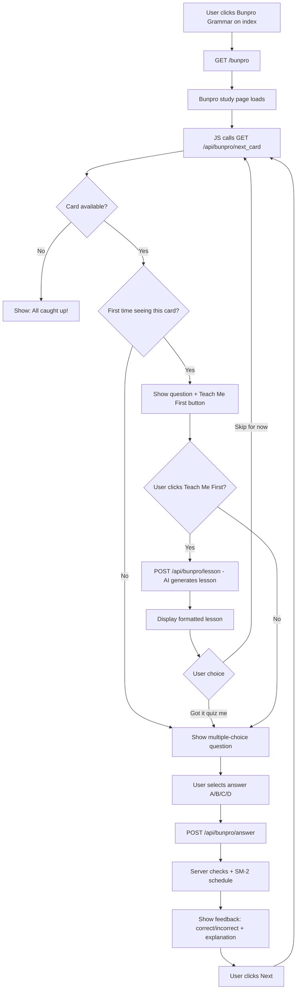

# Bunpro Grammar Feature Plan

## Overview

Add a new **Bunpro Grammar** study mode — a separate, dedicated study page that teaches Japanese grammar points using **multiple-choice questions** generated by an LLM. Grammar points are sourced from the 928-row CSV at `data/bunpro_jlptplus_usage_ranked_heuristic.csv`, introduced in **rank order** (most commonly used first). When encountering a new grammar point for the first time, users can choose **"Teach Me First"** to get an AI-generated lesson before attempting the quiz.

---

## CSV Data Structure

File: `data/bunpro_jlptplus_usage_ranked_heuristic.csv` — 928 grammar points

| Column | Example | Description |
|--------|---------|-------------|
| rank | 1 | Usage frequency rank (1 = most common) |
| usage_tier | S (ubiquitous) | S/A/B/C/D tier |
| score | 110.0 | Heuristic score |
| register | general | general / archaic/literary |
| jlpt | N5 | JLPT level (N5–N1, N0) |
| id | 1.0 | Bunpro internal ID |
| grammar | だ | Grammar point in Japanese |
| meaning | "To be, Is" | English meaning(s) |
| url | https://bunpro.jp/... | Link to Bunpro reference |
| norm | だ | Normalized form |

---

## Architecture

### New Database Model: `BunproGrammar`

A new SQLAlchemy model in `llm_learn_japanese/db.py` to store the imported CSV data along with SRS scheduling state. This is **separate** from the existing `Grammar` table because:
- It has curated metadata (rank, tier, JLPT, Bunpro URL)
- It follows a fixed curriculum order
- It uses multiple-choice instead of free-text answers

```python
class BunproGrammar(Base):
    __tablename__ = "bunpro_grammar"
    id            = Column(Integer, primary_key=True)
    rank          = Column(Integer, nullable=False, unique=True)
    usage_tier    = Column(String, nullable=False)
    score         = Column(Float)
    register      = Column(String)
    jlpt          = Column(String)
    bunpro_id     = Column(Float)
    grammar       = Column(String, nullable=False)
    meaning       = Column(Text)
    url           = Column(String)
    norm          = Column(String)
    # SRS fields
    next_review   = Column(DateTime, default=now)
    interval      = Column(Integer, default=1)
    ease_factor   = Column(Float, default=2.5)
    repetitions   = Column(Integer, default=0)
    success_count = Column(Integer, default=0)  # 0=unseen, -1=introduced
    # Lesson tracking
    lesson_viewed = Column(Boolean, default=False)
```

**Key design choice**: No `CardAspect` children for Bunpro cards. Each `BunproGrammar` row is its own schedulable card. This keeps it simple since all questions are multiple-choice about the same grammar point (no separate "meaning" vs "usage" aspects).

### Alembic Migration

A new migration in `migrations/versions/` to create the `bunpro_grammar` table.

### CSV Import Script

A new script `import_bunpro.py` that:
1. Reads `data/bunpro_jlptplus_usage_ranked_heuristic.csv`
2. Inserts each row as a `BunproGrammar` record
3. Skips duplicates (by rank) on re-run
4. Can be run standalone: `python import_bunpro.py`

---

## Multiple-Choice Question Types

The LLM generates a **random question type** each time a card is reviewed. All questions return structured JSON with a question stem and 4 choices (A–D). Here are the **6 question types**:

### Type 1: Meaning Match
> **"What does 「ので」 mean?"**
> A) Even if, Even though
> B) Because, So, Since ✓
> C) But, However
> D) In order to

The LLM provides the target grammar's meaning as the correct answer and generates 3 plausible distractors from similar grammar points.

### Type 2: Grammar Identification
> **"Which grammar point is used in this sentence?"**
> 「雨が降ったので、出かけませんでした。」
> A) から
> B) けど
> C) ので ✓
> D) のに

The LLM generates a sentence using the target grammar, then offers 3 similar grammar points as distractors.

### Type 3: Fill in the Blank
> **"Choose the correct grammar to complete the sentence:"**
> 「日本語が上手に＿＿＿＿、毎日練習しています。」
> A) なるので
> B) なりたくて ✓
> C) なったから
> D) なるのに

A sentence with a blank where only one grammar choice fits naturally.

### Type 4: English to Grammar
> **"Which grammar point would you use to say 'I want to do'?"**
> A) ている
> B) てから
> C) たい ✓
> D) ておく

Given an English meaning/intention, pick the correct grammar point.

### Type 5: Correct Usage
> **"Which sentence correctly uses 「てもいい」?"**
> A) ここで写真を撮ってもいいですか。 ✓
> B) ここで写真を撮るてもいいですか。
> C) ここで写真を撮りてもいいですか。
> D) ここで写真をてもいい撮りますか。

Only one of 4 sentences uses the grammar correctly. Tests conjugation and placement knowledge.

### Type 6: Nuance / Context
> **"When would you most naturally use 「ので」 instead of 「から」?"**
> A) In casual conversation with close friends
> B) When stating a reason politely or in writing ✓
> C) When giving a direct command
> D) When making a guess about something

Tests understanding of formality, register, and usage nuance.

### Difficulty Scaling
- **Beginner** (success_count < 3): Mostly Type 1 (Meaning Match) and Type 4 (English to Grammar) — simpler recognition tasks
- **Intermediate** (success_count 3–8): Mix of all types, including Type 2 and Type 3
- **Advanced** (success_count > 8): Emphasis on Type 5 (Correct Usage) and Type 6 (Nuance) — deeper understanding

---

## "Teach Me First" Feature

When a grammar point has `success_count == 0` (never seen before), the UI shows an extra button: **"📖 Teach Me First"**.

Clicking it triggers an LLM call that generates a structured lesson:

```json
{
  "grammar_point": "ので",
  "meaning": "Because, So, Since",
  "jlpt_level": "N5",
  "explanation": "ので connects a reason clause to a result...",
  "formation": "Verb-casual + ので / な-adj + なので / Noun + なので",
  "examples": [
    {"japanese": "雨が降ったので、出かけませんでした。", "english": "Because it rained, I didn't go out."},
    {"japanese": "便利なので、よく使います。", "english": "Because it's convenient, I use it often."}
  ],
  "tips": "ので is softer and more polite than から. Use it in formal situations.",
  "comparison": "から is more direct/casual; ので is softer/formal"
}
```

The lesson is displayed in a formatted card. After reading, the user can:
- **"Got it, quiz me!"** → proceed to the multiple-choice question
- **"Skip for now"** → skip the card (it stays as unseen, comes back later)

The lesson content is **not cached** — regenerated each time to provide variety. The `lesson_viewed` flag tracks whether this grammar point has ever been taught (for progress stats).

---

## Study Flow



---

## File Changes Summary

### New Files
| File | Purpose |
|------|---------|
| `import_bunpro.py` | Script to import CSV into `bunpro_grammar` table |
| `templates/bunpro.html` | Bunpro Grammar study page (multiple-choice UI) |
| `templates/bunpro_list.html` | Optional: browse all grammar points and progress |
| `migrations/versions/xxxx_add_bunpro_grammar.py` | Alembic migration for new table |

### Modified Files
| File | Changes |
|------|---------|
| `llm_learn_japanese/db.py` | Add `BunproGrammar` model, `get_next_bunpro_card()`, `review_bunpro_card()`, `get_bunpro_progress()` |
| `llm_learn_japanese/exercises.py` | Add `generate_bunpro_exercise()` for MC questions, `generate_bunpro_lesson()` for teaching |
| `app.py` | Add routes: `/bunpro`, `/api/bunpro/next_card`, `/api/bunpro/answer`, `/api/bunpro/lesson`, `/api/bunpro/chat` |
| `templates/index.html` | Add Bunpro Grammar card to dashboard |
| `main.py` | Add Bunpro Grammar menu option to terminal UI |
| `static/css/style.css` | Add MC button styles, lesson card styles |

### Unchanged Files
| File | Reason |
|------|--------|
| `llm_learn_japanese/scheduler.py` | Reuse existing `sm2_schedule()` as-is |
| `llm_learn_japanese/structured.py` | Not relevant to this feature |

---

## API Endpoints

### `GET /bunpro`
Renders the Bunpro study page template.

### `GET /api/bunpro/next_card`
Returns the next grammar card to study. Logic:
1. Check for due review cards (success_count > 0, next_review <= now)
2. Otherwise pick next unseen card by rank order (success_count == 0)
3. Enforce daily new card limit from UserSettings
4. Generate a multiple-choice question via LLM
5. Return JSON with question, choices, card metadata, and `is_new` flag

Response:
```json
{
  "status": "success",
  "card": {
    "id": 29,
    "grammar": "ので",
    "meaning": "Because, So, Since",
    "jlpt": "N5",
    "rank": 29,
    "is_new": true,
    "question": "What does 「ので」 mean?",
    "question_type": "meaning_match",
    "choices": [
      {"key": "A", "text": "Even if, Even though"},
      {"key": "B", "text": "Because, So, Since"},
      {"key": "C", "text": "But, However"},
      {"key": "D", "text": "In order to"}
    ],
    "correct_key": "B"
  }
}
```

### `POST /api/bunpro/answer`
Submit answer, auto-grade (no AI needed — just check key match), apply SM-2.

Request:
```json
{
  "card_id": 29,
  "selected_key": "B"
}
```

Response:
```json
{
  "status": "success",
  "is_correct": true,
  "correct_key": "B",
  "score": 5,
  "feedback": "Correct! ので means 'Because, So, Since'. It's a softer alternative to から.",
  "next_review": "2026-02-09T01:35:00Z"
}
```

### `POST /api/bunpro/lesson`
Generate an AI lesson for a grammar point.

Request: `{"card_id": 29}`

Response:
```json
{
  "status": "success",
  "lesson": {
    "grammar_point": "ので",
    "meaning": "Because, So, Since",
    "explanation": "...",
    "formation": "...",
    "examples": [...],
    "tips": "...",
    "comparison": "..."
  }
}
```

### `POST /api/bunpro/chat`
Multi-turn chat with tutor about current grammar point (reuse existing chat pattern).

---

## Grading Logic

Multiple-choice grading is deterministic — no AI needed for scoring:
- **Correct answer**: quality = 5 (perfect recall)
- **Incorrect answer**: quality = 1 (wrong, but they saw the correct answer)

The AI is still used for the **feedback message** after answering — it generates a brief explanation of why the answer is correct/incorrect and reinforces the grammar point. This makes each review feel fresh and educational.

---

## Implementation Order

1. **Database**: Add `BunproGrammar` model + Alembic migration
2. **Import**: Create `import_bunpro.py` and load CSV data
3. **DB functions**: `get_next_bunpro_card()`, `review_bunpro_card()`, `get_bunpro_progress()`
4. **Exercise generation**: `generate_bunpro_exercise()` (MC questions), `generate_bunpro_lesson()`
5. **Flask routes**: All `/bunpro` and `/api/bunpro/*` endpoints
6. **Template**: `bunpro.html` with MC UI, lesson display, chat support
7. **Index integration**: Add Bunpro card to `index.html`
8. **Styling**: MC button styles in `style.css`
9. **Terminal UI**: Add to `main.py` menu (optional/lower priority)
10. **Tests**: Unit tests for DB functions, exercise generation, API endpoints
