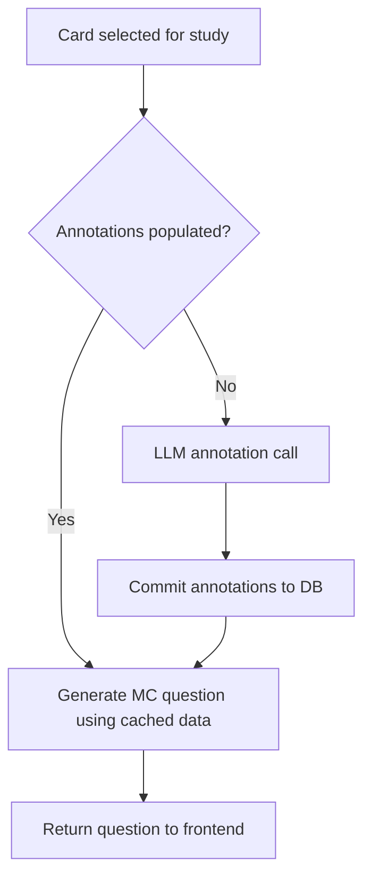
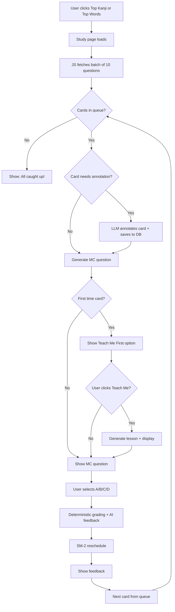

# Top Kanji & Top Words Feature Plan

## Overview

Add two new **separate study modes** — **Top Kanji** and **Top Words** — each with its own tab, using the same batch-fetched multiple-choice pattern as Bunpro Grammar. Cards are introduced in descending frequency order. Both features use a **lazy LLM annotation** strategy: metadata fields (meanings, readings) are populated on-demand via LLM when a card is first studied, then cached in the DB permanently.

---

## CSV Data Analysis

### Kanji CSV: `data/top_10000_kanji.csv` — 10,433 rows

| Column | Example | Status |
|--------|---------|--------|
| rank | 1 | ✅ Has data |
| kanji | 人 | ✅ Has data |
| count | 68196111 | ✅ Has data (incidence) |
| on_readings | *(empty)* | ❌ Empty — needs LLM |
| kun_readings | *(empty)* | ❌ Empty — needs LLM |
| nanori | *(empty)* | ❌ Empty — needs LLM |
| meanings_en | *(empty)* | ❌ Empty — needs LLM |

**Problem**: All annotation columns are completely empty. Only the character and its frequency rank are available from the CSV.

### Words CSV: `data/top_20000_words.csv` — 20,001 rows

| Column | Example | Status |
|--------|---------|--------|
| rank | 1 | ✅ Has data |
| lemma | する | ✅ Has data |
| reading | シ | ⚠️ Has data but sometimes wrong homophone |
| count | 233535711 | ✅ Has data (incidence) |
| meanings_en | "to chafe; to file..." | ❌ **Unreliable** — matches wrong homophone |
| pos_tags | "Godan verb..." | ⚠️ Has data but sometimes wrong |
| alt_readings_kana | する | ⚠️ Has data |
| alt_spellings_kanji | 刷る 摩る... | ⚠️ Has data but often wrong homophone |

**Problem**: The `meanings_en` column frequently maps to the **wrong homophone**. Examples:
- `する` → meanings from 刷る/摩る instead of the verb "to do"
- `その` → "garden, orchard" (園) instead of demonstrative "that"
- `ここ` → "nine" (九) instead of "here"
- `たち` → "large sword" (太刀) instead of plural suffix
- `ちゃん` → "father" (父) instead of the honorific suffix

---

## Lazy LLM Annotation Strategy

### Core Idea
Import only the skeleton data from CSVs (rank, character/lemma, count). When a card comes up for study **for the first time**, call the LLM to populate the annotation fields, then commit them to the database. All subsequent visits use the cached annotations.

### Annotation Flow



### Kanji Annotation Prompt
When a kanji card like 人 has empty annotations, we ask the LLM:
```
Given the kanji character 「人」, provide its standard dictionary information.
Return JSON: {
  "on_readings": "ジン, ニン",
  "kun_readings": "ひと, -り, -と",
  "meanings_en": "person, people, human",
  "jlpt_level": "N5"
}
```
The response is validated and stored in the DB row.

### Word Annotation Prompt
When a word card like する has dubious meanings, we ask the LLM:
```
Given the Japanese word 「する」 (lemma form, rank #1 by frequency),
provide its PRIMARY meaning as used in everyday Japanese.
Ignore rare/archaic homophone meanings.
Return JSON: {
  "reading": "する",
  "meanings_en": "to do, to make, to perform",
  "pos_tags": "verb (irregular)",
  "jlpt_level": "N5"
}
```
The corrected data overwrites the dubious CSV data.

### Annotation Batching
Since we already batch-fetch 10 questions at a time, annotations happen during batch generation. When generating a batch:
1. Select next 10 cards by rank
2. For each card, check if annotated
3. If not, annotate via LLM (this makes the first batch slower)
4. Generate MC questions using the now-populated data
5. Subsequent batches are fast (annotations already cached)

**First batch will be slower** (annotating ~10 cards), but after that, everything is cached. This is acceptable since it's a one-time cost per card.

---

## Database Models

### `TopKanji` Model

```python
class TopKanji(Base):
    __tablename__ = "top_kanji"
    id            = Column(Integer, primary_key=True)
    rank          = Column(Integer, nullable=False, unique=True)
    kanji         = Column(String, nullable=False)
    count         = Column(Integer)  # frequency count from corpus
    # LLM-populated fields (initially empty)
    on_readings   = Column(Text)     # e.g. "ジン, ニン"
    kun_readings  = Column(Text)     # e.g. "ひと, -り"
    meanings_en   = Column(Text)     # e.g. "person, people, human"
    jlpt_level    = Column(String)   # e.g. "N5"
    annotated     = Column(Boolean, default=False)  # True once LLM has populated
    # SRS fields
    next_review   = Column(DateTime, default=now)
    interval      = Column(Integer, default=1)
    ease_factor   = Column(Float, default=2.5)
    repetitions   = Column(Integer, default=0)
    success_count = Column(Integer, default=0)
    lesson_viewed = Column(Boolean, default=False)
```

### `TopWord` Model

```python
class TopWord(Base):
    __tablename__ = "top_words"
    id            = Column(Integer, primary_key=True)
    rank          = Column(Integer, nullable=False, unique=True)
    lemma         = Column(String, nullable=False)
    reading_csv   = Column(String)   # Original reading from CSV
    count         = Column(Integer)  # frequency count from corpus
    # LLM-populated fields (replaces dubious CSV data)
    reading       = Column(Text)     # Corrected reading, e.g. "する"
    meanings_en   = Column(Text)     # Corrected meaning, e.g. "to do, to make"
    pos_tags      = Column(Text)     # Corrected POS, e.g. "verb (irregular)"
    jlpt_level    = Column(String)   # e.g. "N5"
    annotated     = Column(Boolean, default=False)
    # SRS fields
    next_review   = Column(DateTime, default=now)
    interval      = Column(Integer, default=1)
    ease_factor   = Column(Float, default=2.5)
    repetitions   = Column(Integer, default=0)
    success_count = Column(Integer, default=0)
    lesson_viewed = Column(Boolean, default=False)
```

---

## Multiple-Choice Question Types

### Kanji Question Types (5 types)

#### Type 1: Meaning Match
> **"What does the kanji 「人」 mean?"**
> A) Mountain
> B) Water
> C) Person ✓
> D) Fire

#### Type 2: On-reading Match
> **"What is the onyomi reading of 「人」?"**
> A) サン
> B) ジン ✓
> C) スイ
> D) カ

#### Type 3: Kun-reading Match
> **"What is the kunyomi reading of 「人」?"**
> A) やま
> B) ひと ✓
> C) みず
> D) ひ

#### Type 4: Kanji from Meaning
> **"Which kanji means 'person'?"**
> A) 山
> B) 水
> C) 人 ✓
> D) 火

#### Type 5: Kanji in Context
> **"Which sentence correctly uses 「人」?"**
> A) あの人は先生です。 ✓
> B) あの山は先生です。
> C) あの水は先生です。
> D) あの火は先生です。

**Difficulty scaling:**
- Beginner (success < 3): Types 1, 4 (simpler recognition)
- Intermediate (3-8): All types
- Advanced (8+): Types 2, 3, 5 (readings and context)

### Word Question Types (5 types)

#### Type 1: Meaning Match
> **"What does 「自分」 mean?"**
> A) Time
> B) Place
> C) Oneself ✓
> D) Person

#### Type 2: Reading Match
> **"What is the reading of 「行く」?"**
> A) くる
> B) いく ✓
> C) みる
> D) する

#### Type 3: Word from Meaning
> **"Which word means 'to understand'?"**
> A) 食べる
> B) 走る
> C) 分かる ✓
> D) 書く

#### Type 4: Fill in the Blank
> **"Choose the correct word to complete: 日本語が___ですか？"**
> A) 好き ✓
> B) 高い
> C) 遠い
> D) 早い

#### Type 5: Usage Context
> **"In which sentence is 「少し」 used correctly?"**
> A) 少し待ってください。 ✓
> B) 少し机です。
> C) 少し赤い行きます。
> D) 少し食べる飲みました。

**Difficulty scaling:**
- Beginner (success < 3): Types 1, 3 (meaning recognition)
- Intermediate (3-8): All types
- Advanced (8+): Types 2, 4, 5 (readings and usage)

---

## Study Flow

Both features follow the exact same batch-fetching pattern as Bunpro Grammar:



---

## Template Reuse Strategy

Since both features use the identical UI pattern as Bunpro, we will create a **shared template** `templates/mc_study.html` that accepts configuration parameters:

```jinja


<!-- Same MC UI as bunpro.html but parameterized -->
<script>
const STUDY_CONFIG = {
    batchUrl: "{{ batch_url }}",
    answerUrl: "{{ answer_url }}",
    lessonUrl: "{{ lesson_url }}",
    chatUrl: "{{ chat_url }}",
    title: "{{ title }}",
    subtitle: "{{ subtitle }}",
    newSessionUrl: "{{ new_session_url }}",
};
</script>

```

This avoids duplicating the ~400-line template three times. The Bunpro template can also be refactored to use this shared template.

---

## Import Strategy

### How many to import?
- **Kanji**: Import all 10,433 rows (just rank + character + count — lightweight)
- **Words**: Import top 10,000 rows only (the user said "top 10000 words"). Just rank + lemma + reading_csv + count.

Annotations are NOT imported — they're populated lazily.

---

## File Changes Summary

### New Files
| File | Purpose |
|------|---------|
| `migrations/versions/xxxx_add_top_kanji_and_words.py` | Alembic migration for both tables |
| `import_top_kanji.py` | Import script for kanji CSV |
| `import_top_words.py` | Import script for words CSV |
| `templates/mc_study.html` | Shared MC study template (parameterized) |
| `tests/test_top_kanji.py` | Tests for kanji feature |
| `tests/test_top_words.py` | Tests for words feature |

### Modified Files
| File | Changes |
|------|---------|
| `llm_learn_japanese/db.py` | Add `TopKanji` and `TopWord` models + DB functions (get_next, review, annotate, progress, distractors) |
| `llm_learn_japanese/exercises.py` | Add `generate_kanji_mc_exercise()`, `generate_word_mc_exercise()`, `annotate_kanji()`, `annotate_word()`, lesson generators |
| `app.py` | Add routes for `/kanji-study`, `/words-study`, batch/answer/lesson/chat APIs for both |
| `templates/index.html` | Add Top Kanji and Top Words cards to dashboard |
| `templates/base.html` | Add navbar links for both |
| `templates/bunpro.html` | Refactor to use shared `mc_study.html` template |

---

## Implementation Order

1. **Database**: Add `TopKanji` and `TopWord` models + Alembic migration
2. **Import**: Create import scripts for both CSVs (skeleton data only)
3. **Annotation engine**: Add `annotate_kanji()` and `annotate_word()` LLM functions
4. **DB functions**: get_next, review, progress, distractors for both
5. **Shared template**: Create `mc_study.html` parameterized template
6. **Exercise generation**: MC question generators for kanji and words
7. **Flask routes**: All endpoints for both features
8. **Index + navbar**: Add cards and links
9. **Refactor Bunpro**: Update `bunpro.html` to use shared template
10. **Tests**: Unit tests for all new functionality
